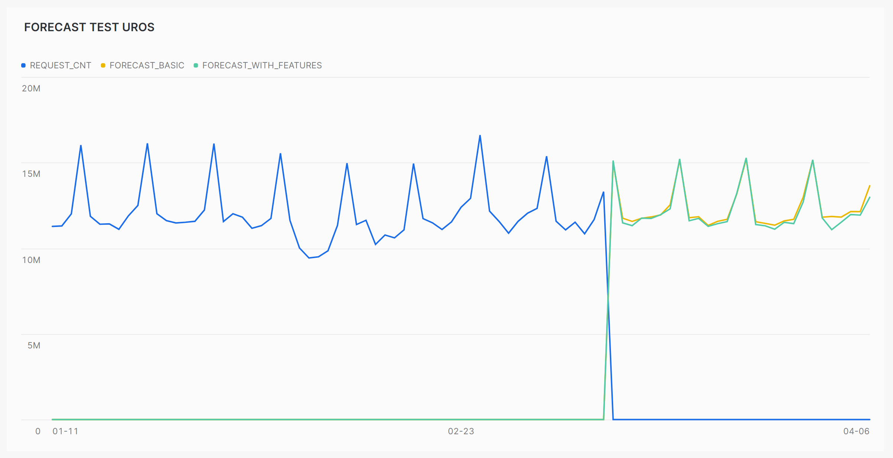

# Forecasting with Snowflake Cortex ML functions

Snowflake Cortex comprises a set of ML (machine learning) and LLM (large language models) functions designed to simplify the implementation of various models based on data within the Snowflake Data Warehouse (DWH). This guide provides a simple walkthrough for preparing data, training a model, and invoking forecasting functions.

This guide covers two different concepts:

- Basic forecasting
- Forecasting with features

## Pre-requisites

To run this guide effectively, you will need to meet the following requirements:

1. **Snowflake Platform Account**: Ensure you have an active account on the Snowflake platform. If you don't have one yet, sign up for a Snowflake account on their website.

2. **User/Role Configuration with Permissions**:
   - Configure a user or role with the necessary permissions to select tables and generate views within your Snowflake account.
   - This user or role should have privileges to access the required database objects (tables, views) for data preparation, model training, and forecasting.

3. **Configured Warehouse**:
   - Set up a Snowflake warehouse configured to run queries. 
   - Ensure that the warehouse is properly scaled based on the size of your dataset and computational requirements.

4. **Test Data According to Data Schema**:
   - Prepare test data that adheres to the data schema required for the forecasting tasks outlined in the guide.
   - The data schema should include all necessary fields and formats expected by the forecasting models.


## Data scheme

Guide is based on following data scheme:
```sql
create or replace TABLE MYDATABASE.PUBLIC.EVENTS (
	TIME TIMESTAMP_NTZ(9) NOT NULL,
	EVENT_TYPE VARCHAR(50) NOT NULL
);
```
## Guidelines

Here are guidelines (set of SQL queries) for two different concepts:

1. [Basic Forecasting](basic-forecasting.sql): A simple forecasting model trained with historical data.

2. [Forecasting with Features](forecasting-with-features.sql): An advanced forecasting model that enhances data with two flags (Saturday & Sunday). It assumes that the usage of the item being forecasted increases during weekends, hence the addition of these two features/flags."

## Comparison of results (Basic vs Features)

I ran a couple of different tests comparing the forecasts generated by a basic model and a model enhanced with features. Given that my data consistently shows increased requests on Saturdays and Sundays, adding feature flags for these two days significantly outperformed the basic model.

An example of this comparison can be seen in the figure below:

